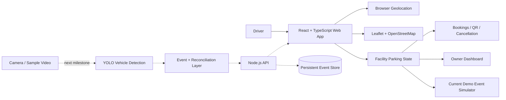

# SPF — Smart Parking Finder

**Find. Park. Go.**

[](https://github.com/ArYanGIT769/smart-parking-finder-sih-2026/actions/workflows/ci.yml)

**SIH 2026 software prototype · Transportation & Logistics · SGSITS Indore**

SPF is an Indore-focused smart parking prototype that helps drivers discover nearby parking, view live-style availability, check EV charging and accessible parking, reserve a space, navigate to it, and manage bookings. Parking operators get a facility-level dashboard for occupancy, vehicle movement, EV resources, accessible spaces and revenue.

**Live demo:** https://smart-parking-finder-spf.netlify.app/

> **Current status:** Working interactive frontend prototype. Browser geolocation is real. Parking facility data and live occupancy events are simulated for the current demo. API/database and YOLO-based vehicle-event integration are the next engineering milestone.

## Why we built it

Parking information is fragmented. Drivers often reach a destination before knowing whether parking is actually available, while many existing parking facilities do not have a simple digital layer connecting occupancy, reservations and driver discovery.

SPF is designed around a **low-cost retrofit approach**: add camera/edge intelligence and a software layer to existing facilities instead of assuming every parking bay already has dedicated smart infrastructure.

## What works today

- Real browser geolocation with distance-based parking discovery
- Interactive Indore map using Leaflet + OpenStreetMap
- Facility-specific availability and occupancy state
- Standard, EV and accessible/PWD-reserved parking categories
- EV charger availability
- Booking, QR confirmation and cancellation flow
- Google Maps / OpenStreetMap navigation links
- Owner dashboard with facility selector
- Vehicle ENTRY / EXIT simulation with active-vehicle state
- EV charger and accessible-space status
- Revenue / occupancy presentation analytics
- Shared frontend state so map, cards, bookings and owner dashboard stay synchronized
- localStorage persistence for prototype state

## Core technical idea

A major engineering direction is **reservation-aware occupancy reconciliation**.

```text
Available -> Reserved -> Occupied -> Available
Available -------------> Occupied -> Available   (walk-in)
Reserved --------------> Available              (cancel / expiry)
```

A reserved vehicle should transition a space from `Reserved` to `Occupied` when it arrives — not reduce capacity twice. The same state model can be extended to EV spaces, chargers and accessible parking resources.

The screening target is to drive these transitions from real vehicle events rather than only the current simulator.

## Architecture



More detail: [`docs/ARCHITECTURE.md`](docs/ARCHITECTURE.md)

## Tech stack

| Layer | Technology / status |
|---|---|
| Frontend | React 18, TypeScript, Vite |
| Styling | Tailwind CSS |
| Maps | React Leaflet, Leaflet, OpenStreetMap |
| Location | Browser Geolocation API |
| QR | qrcode.react |
| Prototype persistence | localStorage |
| Deployment | Netlify |
| Backend | Planned screening milestone: Node.js / Express API |
| Database | Planned screening milestone: persistent parking + event store |
| Computer vision | Planned screening milestone: YOLO vehicle inference |

## Repository layout

```text
.
├── src/
│   ├── components/
│   ├── data/
│   ├── pages/
│   ├── ParkingContext.tsx
│   ├── NavContext.tsx
│   └── types.ts
├── docs/
│   ├── API_CONTRACT.md
│   ├── ARCHITECTURE.md
│   ├── DEMO_SCRIPT.md
│   ├── ROADMAP.md
│   ├── SCREENING_CHECKLIST.md
│   └── SECURITY.md
├── .github/
│   ├── ISSUE_TEMPLATE/
│   ├── workflows/ci.yml
│   └── PULL_REQUEST_TEMPLATE.md
├── netlify.toml
├── package.json
└── README.md
```

## Run locally

Requires Node.js 20+ and npm.

```bash
npm install
npm run dev
```

Verification:

```bash
npm run typecheck
npm run build
```

## Planned event API

Example vehicle event:

```json
{
  "parkingId": "vijay-nagar",
  "event": "ENTRY",
  "vehicleNumber": "MP09AB4821",
  "vehicleType": "EV",
  "timestamp": "2026-09-08T16:00:00Z",
  "confidence": 0.97
}
```

See [`docs/API_CONTRACT.md`](docs/API_CONTRACT.md).

## Security and privacy direction

The current owner gate and camera/backend indicators are prototype controls, not production security. Production design requires authenticated operator roles, encrypted traffic, validation/rate limiting, audit logs and minimal number-plate retention. Raw camera footage should not be retained unless operationally necessary.

See [`docs/SECURITY.md`](docs/SECURITY.md).

## Development workflow

We use GitHub to keep technical work reviewable and attributable:

1. Create/assign an Issue for a meaningful task.
2. Implement and test the change.
3. Commit with a descriptive message (`feat:`, `fix:`, `docs:`, `test:`).
4. Use a pull request for team review when practical.
5. Keep unfinished capabilities labelled as planned/in progress rather than presenting them as complete.

See [`CONTRIBUTING.md`](CONTRIBUTING.md).

## SIH screening target

The next proof-of-concept milestone is one complete vertical slice:

```text
camera/video
    -> YOLO inference
    -> validated ENTRY/EXIT event
    -> API
    -> persistent event store
    -> SPF availability update
```

This is intentionally prioritised over adding more UI features.

## Team

**Team Nexus Mind · SGSITS Indore**

Before SIH submission, the team name, Problem Statement ID/title, member roster, category and theme must be copied **exactly** from the SIH portal.

## Project status

**Working software prototype · SIH 2026 screening-stage technical development**
