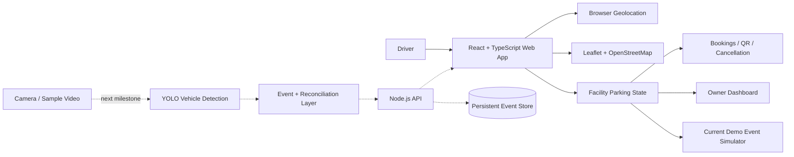

# SPF — Smart Parking Finder

**Find. Park. Go.**

### Smart India Hackathon 2026

| Field | Details |
|---|---|
| Problem Statement ID | **SIH26198** |
| Problem Statement Title | **STUDENT INNOVATION** |
| Theme | **Transportation & Logistics** |
| Category | **Software** |
| Team ID | **115** |
| Institute | **Shri G. S. Institute of Technology & Science (SGSITS), Indore** |
| Pilot City | **Indore, Madhya Pradesh** |
| Target Deployment | **Tier-1 → Tier-2 → Tier-3 Cities** |


### Current Prototype

The current web prototype uses simulated vehicle registrations and simulated camera/backend status for demonstrating the parking-management workflow.

Browser geolocation is real when the user grants permission.

Production ANPR, API persistence and edge-camera integration are part of the next engineering stage.


[](https://github.com/ArYanGIT769/smart-parking-finder-sih-2026/actions/workflows/ci.yml)


**SIH 2026 · SIH26198 · STUDENT INNOVATION · Transportation & Logistics · Software · SGSITS Indore**
SPF is a smart parking platform designed primarily for high-density Tier-1 cities, where drivers frequently lose time and fuel searching for available parking.

Indore is being used as the current pilot and demonstration city. After validating the operating model, the system is designed to scale progressively to Tier-2 and Tier-3 cities.

SPF helps drivers discover nearby parking, view live-style availability, check EV charging and accessible/PWD-reserved parking, reserve a space, navigate to the facility and manage bookings. Parking operators receive a facility-level dashboard for occupancy, vehicle movement, EV resources, accessible spaces and operational analytics.


**Live demo:** https://smart-parking-finder-spf.netlify.app/


> **Current status:** Working interactive frontend prototype. Browser geolocation is real. Parking facility data and live occupancy events are simulated for the current demo. API/database and YOLO-based vehicle-event integration are the next engineering milestone.

## Why we built it

## Deployment Strategy

SPF follows a phased deployment model:

**Phase 1 — Tier-1 Cities**
High-density urban areas where parking-search traffic, congestion and parking demand are highest.

**Phase 2 — Tier-2 Cities**
Deployment through malls, hospitals, campuses, commercial districts and organized parking operators.

**Phase 3 — Tier-3 Cities**
Lower-cost deployments focused on existing parking facilities using retrofit camera and edge-processing infrastructure.

Indore currently serves as the pilot/demo environment for validating the platform workflow.


## What Makes SPF Different

SPF is not intended to be only another parking-booking application.

The core approach is a **low-cost retrofit parking intelligence layer** for existing parking facilities.

Instead of requiring dedicated sensors or smart hardware at every individual parking bay, SPF is designed as a low-cost retrofit layer for existing parking facilities using camera-based entry/exit detection, edge intelligence and software-driven occupancy reconciliation.

Camera / entry-exit detection  
→ edge intelligence  
→ occupancy reconciliation  
→ cloud/API synchronization  
→ driver application + owner dashboard

The same platform combines:

- live parking discovery
- reservation management
- vehicle entry/exit tracking
- EV parking and charging availability
- accessible/PWD-reserved parking
- parking-owner analytics
- navigation
- occupancy synchronization

The long-term goal is to convert fragmented existing parking capacity into a connected city-wide parking network.


## What works today

- Real browser geolocation with distance-based parking discovery
- Interactive Indore map using Leaflet + OpenStreetMap
- Facility-specific availability and occupancy state
- Standard, EV and accessible/PWD-reserved parking categories
- EV charger availability
- Booking, QR confirmation and cancellation flow
- Google Maps / OpenStreetMap navigation links
- Owner dashboard with facility selector
- Vehicle ENTRY / EXIT simulation with active-vehicle state
- EV charger and accessible-space status
- Revenue / occupancy presentation analytics
- Shared frontend state so map, cards, bookings and owner dashboard stay synchronized
- localStorage persistence for prototype state


## Core technical idea

A major engineering direction is **reservation-aware occupancy reconciliation**.

```text
Available -> Reserved -> Occupied -> Available
Available -------------> Occupied -> Available   (walk-in)
Reserved --------------> Available              (cancel / expiry)
```

A reserved vehicle should transition a space from `Reserved` to `Occupied` when it arrives — not reduce capacity twice. The same state model can be extended to EV spaces, chargers and accessible parking resources.

The screening target is to drive these transitions from real vehicle events rather than only the current simulator.


## Architecture
## Scalability

SPF is designed around a city-by-city deployment model.

### Tier-1
Initial focus because parking demand, congestion and search time are highest.

### Tier-2
Expansion through organized parking operators, malls, hospitals, offices, campuses and commercial districts.

### Tier-3
Lower-cost deployments using retrofit camera/edge infrastructure rather than requiring extensive smart-parking hardware.

Each parking facility operates independently while publishing standardized availability data into the SPF platform.




More detail: [`docs/ARCHITECTURE.md`](docs/ARCHITECTURE.md)


## Tech stack

| Layer | Technology / status |
|---|---|
| Frontend | React 18, TypeScript, Vite |
| Styling | Tailwind CSS |
| Maps | React Leaflet, Leaflet, OpenStreetMap |
| Location | Browser Geolocation API |
| QR | qrcode.react |
| Prototype persistence | localStorage |
| Deployment | Netlify |
| Backend | Planned screening milestone: Node.js / Express API |
| Database | Planned screening milestone: persistent parking + event store |
| Computer vision | Planned screening milestone: YOLO vehicle inference |


## Repository layout


```text
.
├── src/
│   ├── components/
│   ├── data/
│   ├── pages/
│   ├── ParkingContext.tsx
│   ├── NavContext.tsx
│   └── types.ts
├── docs/
│   ├── API_CONTRACT.md
│   ├── ARCHITECTURE.md
│   ├── DEMO_SCRIPT.md
│   ├── ROADMAP.md
│   ├── SCREENING_CHECKLIST.md
│   └── SECURITY.md
├── .github/
│   ├── ISSUE_TEMPLATE/
│   ├── workflows/ci.yml
│   └── PULL_REQUEST_TEMPLATE.md
├── netlify.toml
├── package.json
└── README.md
```


## Run locally

Requires Node.js 20+ and npm.

```bash
npm install
npm run dev
```

Verification:

```bash
npm run typecheck
npm run build
```


## Planned event API

Example vehicle event:

```json
{
  "parkingId": "vijay-nagar",
  "event": "ENTRY",
  "vehicleNumber": "MP09AB4821",
  "vehicleType": "EV",
  "timestamp": "2026-09-08T16:00:00Z",
  "confidence": 0.97
}
```

See [`docs/API_CONTRACT.md`](docs/API_CONTRACT.md).


## Security and Privacy

SPF is designed around data minimization.

The parking system does not require the vehicle owner's name, residential address, personal profile or other unnecessary personal information in order to detect parking entry and exit.

Where number-plate recognition is used, the registration string is treated only as an operational identifier for functions such as:

- matching a reservation with an arriving vehicle
- preventing duplicate vehicle-entry records
- maintaining active vehicle state
- recording entry and exit events
- releasing the correct parking resource when a vehicle exits

SPF does not require building a vehicle-owner identity database.


### Privacy-by-Design Direction

For production deployment:

- number-plate identifiers can be tokenized or hashed where full plate retention is unnecessary
- raw camera footage should not be retained by default unless required for a clearly defined operational or security purpose
- edge processing should be preferred where practical
- only operational event data required for parking management should be stored
- short retention periods should be used for vehicle-event identifiers
- encrypted communication should protect API traffic
- parking-owner access should use authenticated roles
- sensitive operational actions should be audit logged
- input validation and rate limiting should protect public APIs

The objective is to maintain parking occupancy and reservation integrity while collecting the minimum amount of personal information required.

See [`docs/SECURITY.md`](docs/SECURITY.md).


> **SPF identifies parking events, not people.**

## Development workflow

We use GitHub to keep technical work reviewable and attributable:

1. Create/assign an Issue for a meaningful task.
2. Implement and test the change.
3. Commit with a descriptive message (`feat:`, `fix:`, `docs:`, `test:`).
4. Use a pull request for team review when practical.
5. Keep unfinished capabilities labelled as planned/in progress rather than presenting them as complete.

See [`CONTRIBUTING.md`](CONTRIBUTING.md).


## SIH Screening Engineering Target

The next proof-of-concept milestone is one complete vertical slice:

Camera / Video  
→ YOLO Vehicle Detection  
→ ENTRY / EXIT Event  
→ Reservation-Aware Validation  
→ API  
→ Persistent Event Store  
→ Occupancy Reconciliation  
→ SPF Live Availability Update

The engineering focus is deliberately placed on proving this end-to-end pipeline rather than adding additional UI features.


## Team

### TEAM NEXUS MIND

**Institute:** Shri G. S. Institute of Technology & Science (SGSITS), Indore  
**Problem Statement ID:** SIH26198  
**Problem Statement Title:** STUDENT INNOVATION
**Team ID:** 115  
**Category:** Software  
**Theme:** Transportation & Logistics 


### Members

1. **Aryan Dubey** — Team Leader
2. **Tushar Dhote**
3. **Shreeneel Shukla**
4. **Gulvish Khan**
5. **Nupur Kharat**
6. **Sakshi Markam**

**Mentor:** Deepesh Agrawal 

## Project status

**Working software prototype · SIH 2026 screening-stage technical development**
