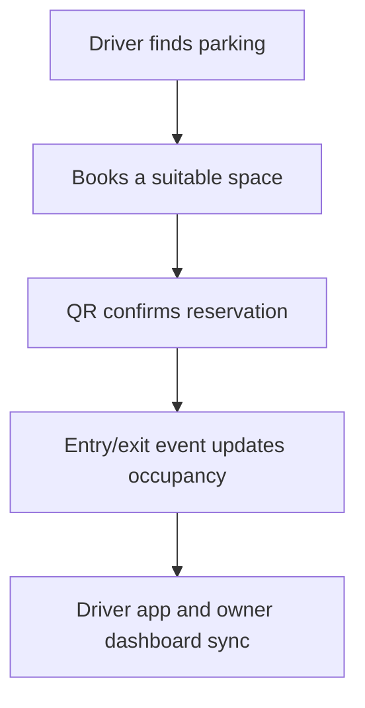
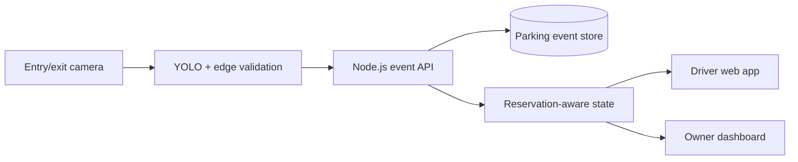

# SPF — Smart Parking Finder

> **Find. Park. Go.** A camera-ready parking discovery and operations platform for crowded Indian cities.

[](https://www.sih.gov.in/)
[](#sih-2026-registration)
[](https://smart-parking-finder-spf.netlify.app/)
[](https://github.com/ArYanGIT769/smart-parking-finder-sih-2026/actions/workflows/ci.yml)

**Live prototype:** [smart-parking-finder-spf.netlify.app](https://smart-parking-finder-spf.netlify.app/)

SPF connects drivers with available parking and gives parking operators one view of occupancy, bookings, EV resources, accessible spaces and vehicle movement. The current Indore prototype proves the complete user and operator workflow; camera-driven occupancy, the Node.js API and persistent event storage are the next engineering slice.

## SIH 2026 registration

| Field | Portal-aligned value |
|---|---|
| Team name | **NEXUS MINDS** |
| Team ID | **126048** |
| Problem statement ID | **SIH26205** |
| Problem statement | **Student Innovation — Submit your ideas to address the growing pressures on the city’s resources, transport networks, and logistic infrastructure.** |
| Theme | **Transportation & Logistics** |
| Category | **Software** |
| Institute | **Shri G. S. Institute of Technology & Science (SGSITS), Indore** |
| Pilot | **Indore, Madhya Pradesh** |

## The problem

Urban drivers often reach a destination without knowing whether a legitimate parking space is available. The result is avoidable circulation, congestion, fuel use, illegal roadside parking and driver stress. At the same time, many existing parking facilities have capacity but no inexpensive digital layer connecting occupancy, reservations and discovery.

## Our solution

SPF is designed as a **low-cost retrofit intelligence layer** for existing parking facilities. Instead of installing one sensor at every bay, a facility can use entry/exit camera events, edge inference and reservation-aware occupancy logic to publish useful availability to drivers.



## What the current prototype proves

| Capability | Evidence status |
|---|---|
| Nearby parking discovery and distance sorting | **Working in browser** |
| Interactive Indore map | **Working in browser** |
| Standard, EV and PWD/accessibility filters | **Working in browser** |
| Booking, QR confirmation and cancellation | **Working in browser** |
| Navigation hand-off to map services | **Working in browser** |
| Facility-level owner dashboard | **Working in browser** |
| Entry/exit and active-vehicle workflow | **Interactive simulation** |
| Occupancy and revenue presentation analytics | **Interactive prototype data** |
| Browser geolocation | **Real, with user permission** |
| Parking inventory and live occupancy feed | **Simulated demo data** |
| YOLO camera inference | **Planned proof-of-concept** |
| Node.js API and persistent database | **Planned integration** |

This separation is deliberate: judges can see what works now and what the team will validate next without confusing prototype data with deployed city infrastructure.

## Judge demo path

1. Open **Explore Parking** and allow location access.
2. Filter for EV charging, PWD-accessible or 24/7/CCTV-enabled facilities.
3. Open a facility, reserve a space and view the QR confirmation.
4. Open **My Bookings** to inspect or cancel the reservation.
5. Open **Owner Dashboard** and demonstrate entry/exit, capacity and vehicle-state changes.

## Technical architecture



The current prototype implements the driver experience, owner experience and shared client-side parking state. Dotted-line production components described in [`docs/ARCHITECTURE.md`](docs/ARCHITECTURE.md) are the next implementation stage.

### Reservation-aware occupancy

The key engineering rule is to prevent double counting:

```text
Available -> Reserved -> Occupied -> Available
Available -------------> Occupied -> Available   (walk-in)
Reserved --------------> Available               (cancel/expiry)
```

When a reserved vehicle arrives, its space moves from `Reserved` to `Occupied`; total availability must not be reduced twice.

## Vehicle protection and responsible data use

SPF can improve vehicle safety by directing drivers toward identified facilities, maintaining entry/exit records, supporting reservation-to-vehicle matching and giving operators a clear active-vehicle view. These measures support incident review and anomaly detection; they are not presented as a guarantee against theft or damage.

The production design follows data minimisation:

- detect **parking events, not people**;
- use a number plate only as an operational identifier when needed;
- tokenize or hash identifiers where full retention is unnecessary;
- avoid retaining raw footage by default;
- prefer edge processing and short retention periods;
- protect operator actions with authenticated roles and audit logs.

See [`docs/SECURITY.md`](docs/SECURITY.md).

## Technology

| Layer | Technology / status |
|---|---|
| Frontend | React 18, TypeScript, Vite |
| Styling | Tailwind CSS |
| Maps | React Leaflet, Leaflet, OpenStreetMap |
| Location | Browser Geolocation API |
| QR | `qrcode.react` |
| Prototype state | React context + `localStorage` |
| Deployment | Netlify |
| Event API | Node.js / Express — planned integration |
| Persistence | Parking and event store — planned integration |
| Computer vision | YOLO vehicle inference — planned proof-of-concept |

## Run and verify

Requires Node.js 20+ and npm.

```bash
npm ci
npm run dev
```

Quality checks used for this submission:

```bash
npm run typecheck
npm run build
```

## Repository map

```text
.
├── src/
│   ├── components/        reusable UI and map components
│   ├── data/              prototype parking facilities
│   ├── pages/             driver, booking and owner flows
│   └── ParkingContext.tsx shared prototype state
├── docs/
│   ├── API_CONTRACT.md
│   ├── ARCHITECTURE.md
│   ├── DEMO_SCRIPT.md
│   ├── ROADMAP.md
│   ├── SCREENING_CHECKLIST.md
│   └── SECURITY.md
├── .github/workflows/ci.yml
├── netlify.toml
└── README.md
```

## Engineering roadmap

- [x] Responsive driver and operator prototype
- [x] Parking discovery, filtering, booking, QR and cancellation
- [x] Shared facility state and interactive entry/exit simulation
- [x] Public deployment and reproducible local build
- [ ] Run YOLO inference on a sample gate video
- [ ] Convert detections into validated `ENTRY` / `EXIT` events
- [ ] Persist events through the Node.js API
- [ ] Reconcile bookings and live occupancy atomically
- [ ] Push updated availability to the driver and operator views
- [ ] Pilot camera placement and low-connectivity fallback at one facility

## Team NEXUS MINDS

| Member | Role |
|---|---|
| Aryan Dubey | Team Leader |
| Tushar Dhote | Team Member |
| Shreeneel Shukla | Team Member |
| Gulvish Khan | Team Member |
| Sakshi Markam | Team Member |
| Nupur Kharat | Team Member |

**Mentor:** Deepesh Agrawal  
**Institute:** Shri G. S. Institute of Technology & Science (SGSITS), Indore

## Submission status

**Working software prototype · SIH 2026 screening-stage engineering**
