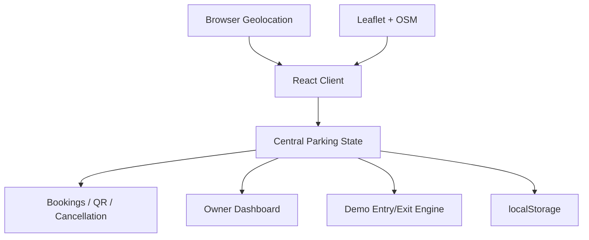
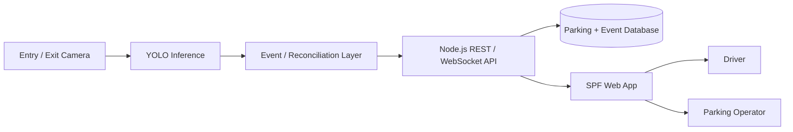

# SPF Technical Architecture

## Current working prototype

The deployed frontend uses one shared parking state so map availability, parking cards, booking/cancellation and Owner Dashboard remain synchronized per parking facility.



## Screening target architecture



## Event lifecycle

1. Camera/video frame is passed through vehicle detection.
2. Detection is converted into an ENTRY/EXIT event with parking ID and timestamp.
3. Reconciliation layer validates the event against active vehicles/reservations.
4. Backend persists the event and updates occupancy atomically.
5. Client receives the new facility state and updates map/card/dashboard.

## Reservation-aware occupancy state

```text
Available -> Reserved -> Occupied -> Available
Available -------------> Occupied -> Available  (walk-in)
Reserved --------------> Available             (cancel/expiry)
```

This prevents the same capacity from being decremented once on reservation and again on check-in.
